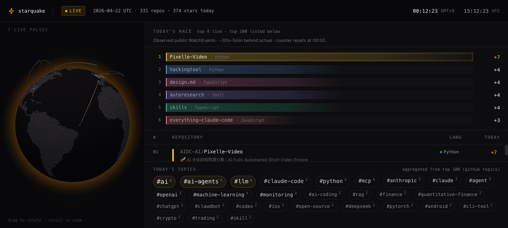

# starquake

Near-real-time GitHub stargazing dashboard. Each star action becomes a tremor on a globe; each trending repo becomes an epicenter on today's leaderboard.

**Live**: [graykode.github.io/starquake](https://graykode.github.io/starquake/)



## What it does

Polls GitHub's public `/events` feed every 5 seconds, filters `WatchEvent`s (stars), and projects them into a live top-100 leaderboard reset at UTC 00:00. Stargazer locations are geocoded offline (GeoNames) and plotted on a three.js globe. Repo metadata (description, language, topics, total stars) is enriched via GraphQL every 30 seconds for the current top-N so hover cards have real data.

- **Live globe** — real stargazer locations rendered as fading rings (drag to rotate, scroll to zoom)
- **Bar race** — top 6 repos with animated bars, reordering on every rank change, flash on star gain
- **Leaderboard** — top 100 scrollable list with description, language dot, today's stars
- **Topic cloud** — aggregated from top-100 `repository.topics` (real GitHub topics, not inferred)
- **Hover card** — description, language, total stars, GitHub topics, live `+today` count
- **Honest UTC** — all data decisions are UTC; the header shows both your local time and UTC

## Architecture

- **Server (Rust)**: single binary running `ingest` + `enrich` + `locate` + WebSocket fanout on one tokio runtime. No Redis, no queue.
- **Frontend (Next.js + three.js)**: static export hosted on GitHub Pages. One long-lived WebSocket feeds both panels.
- **GitHub is the only runtime external dependency.** Geocoding is offline (GeoNames embedded in the binary). History will come from Postgres (Phase 7.6, not yet wired).

See [CLAUDE.md](CLAUDE.md) for the full spec (ingest cadence, rate-limit budget, enrichment policy, CORS, etc.).

## Local dev

Prerequisites: Rust 1.86+, Node 20+, pnpm 8+, a GitHub PAT with public-repo read-only access.

```bash
cp .env.example .env
# edit .env and paste your GITHUB_TOKEN
pnpm install
pnpm dev
```

`pnpm dev` starts the Rust server on `:8080` and the Next.js UI on `:3000`.

## Deploy

- **Server**: Railway (Dockerfile build, service root = `/server`). Env vars: `GITHUB_TOKEN`, `RUST_LOG`, `CORS_ALLOWED_ORIGINS`.
- **UI**: GitHub Pages, deployed by `.github/workflows/pages.yml` on push to `main`. `NEXT_PUBLIC_WS_URL` comes from a repo secret of the same name.

Budget target is ~$1/mo marginal over the Railway Hobby plan.

## Credits

- GeoNames data (`server/data/geonames/cities15000.txt`, `countryInfo.txt`) is © GeoNames, distributed under [CC BY 4.0](https://creativecommons.org/licenses/by/4.0/). See [`server/data/geonames/NOTICE`](server/data/geonames/NOTICE).
- Globe inspired by [janarosmonaliev/github-globe](https://github.com/janarosmonaliev/github-globe) and GitHub's own [github/globe](https://github.com/github/globe).
